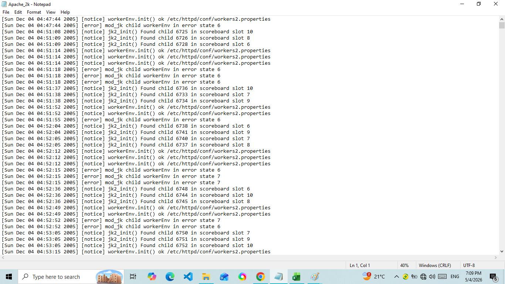
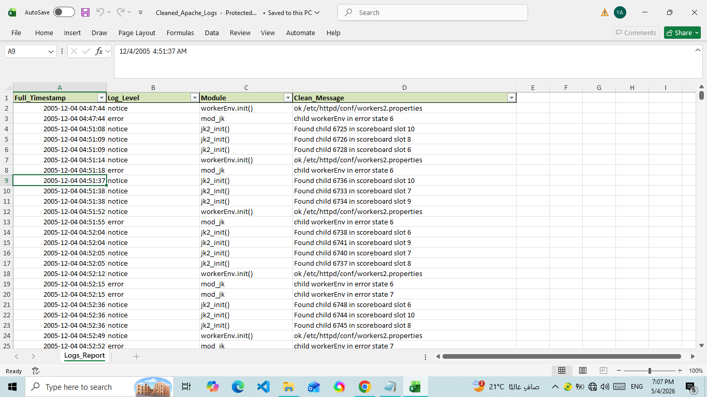

# 📊 Apache Log Data Cleaning & Transformation Report

## 📝 Project Overview
This project aims to transform raw, unstructured **Apache Error Logs** into a clean, structured, and professional **Excel report**. The process involved parsing complex text patterns, cleaning data, and enriching it for better analysis.

---

## 🛠️ Tools & Technologies Used
*   **Python**: The core programming language.
*   **Pandas**: For data manipulation and tabular structure (DataFrames).
*   **Regex (re)**: To parse and extract specific information from raw log lines.
*   **XlsxWriter**: To create a professionally formatted Excel file with filters and styling.

---

## ⚙️ Steps Taken (Data Pipeline)

### 1. Data Ingestion
*   Loaded the raw `Apache_2k.log` file into the environment.

### 2. Regex Parsing (Structuring)
*   Used **Regular Expressions** to break down each text line into three primary components:
    *   `Full_Timestamp`: The exact date and time of the log.
    *   `Log_Level`: The severity (e.g., *notice*, *error*).
    *   `Message`: The full descriptive text.

### 3. Data Cleaning & Type Conversion
*   **Datetime Normalization**: Converted the text-based timestamp into a standard Python `datetime` object for time-series analysis.
*   **String Trimming**: Removed extra spaces and hidden characters from all columns.
*   **Deduplication**: Identified and removed **539 duplicate entries** to ensure data integrity and avoid skewed results.

### 4. Feature Extraction (Advanced Splitting)
*   Extracted the **Module name** (e.g., `workerEnv.init`, `mod_jk`) from the main message to allow for more granular analysis of which system components are reporting issues.

### 5. Professional Export
*   Generated an **Excel file** with:
    *   **Auto-filters** enabled for easy searching.
    *   **Custom formatting** (Header colors, bold text).
    *   **Optimized column widths** for immediate readability.

---
**Done by: [Yehia]**
| Before Cleaning (Missing Values) | After Cleaning (Structured Data) |
| :---: | :---: |
|  |  |
